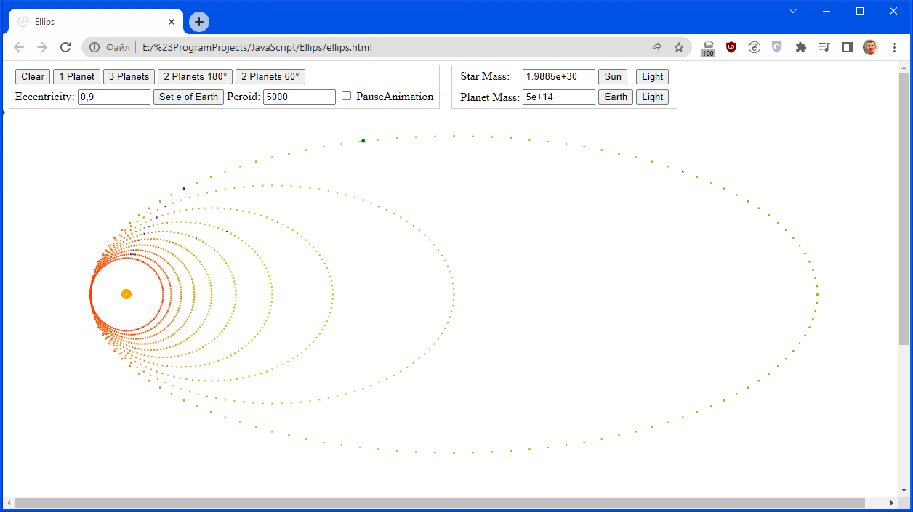

# Ellips
Pet-project для изучения рисовки по Canvas и анимации в Web-приложениях

Симуляция движения планеты с произвольным эксцентриситетом вокруг звезды. 
Также возможна симуляция движения нескольких планет. Есть настройки массы планеты, звезды, период обращения.

Расчёт движения происходит на основе пошаговой симуляции с расчетом притяжения между всеми телами на каждом шаге. Анимация реализована с помощью requestAnimationFrame.

В будущем планируется добавление движения по хореографическим орбитам.

# 

Simulation of the movement of a planet with an arbitrary eccentricity around a star.
It is also possible to simulate the movement of several planets. There are settings for the mass of the planet, stars, period of revolution.
 
The calculation of the movement is based on a step-by-step simulation with the calculation of the attraction between all bodies at each step. Animation is implemented using requestAnimationFrame.